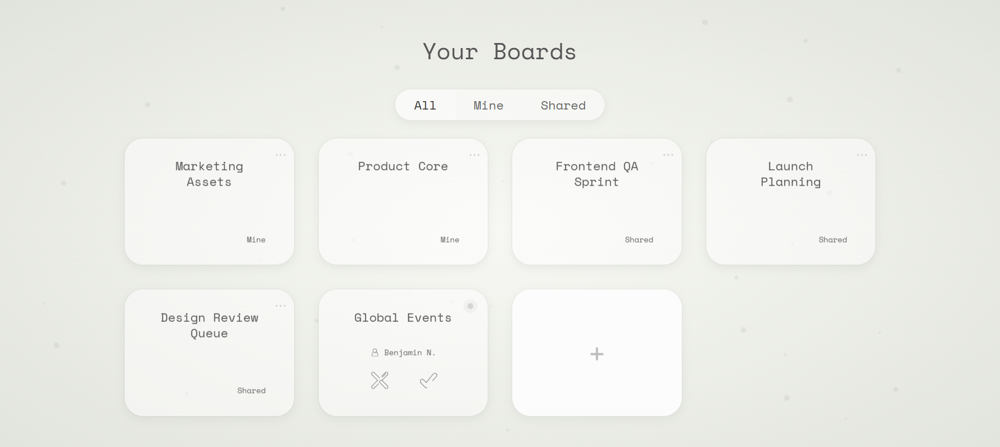
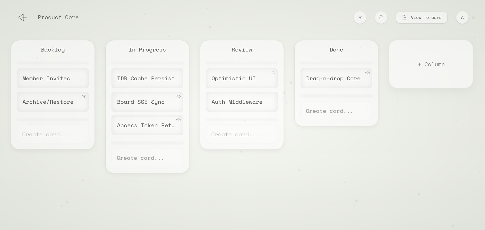
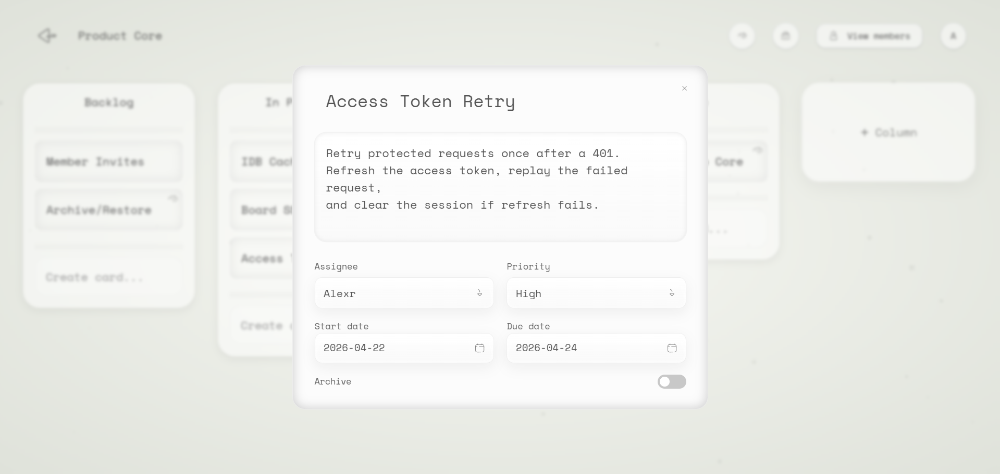
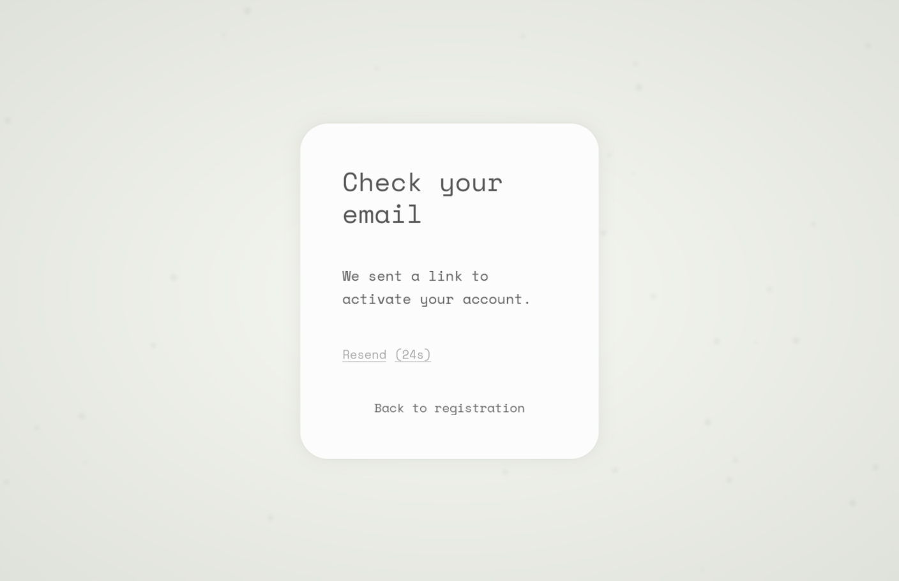
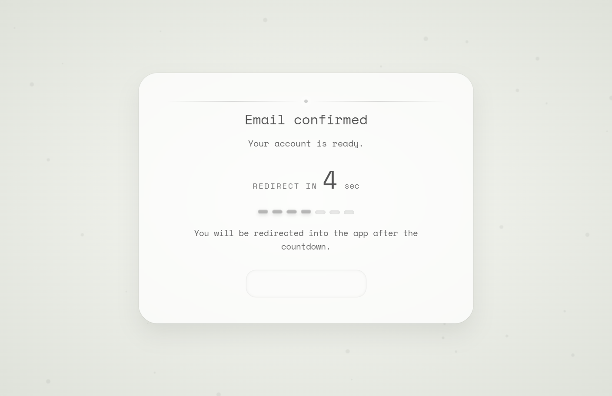

# Collaborative Kanban Frontend | Sphere

Collaborative kanban frontend built with Next.js App Router.

The project was built around a constraint that usually creates trade-offs: the board should feel visually polished and responsive at the same time. The UI leans on motion, drag-and-drop, and a heavier board view, so the frontend combines optimistic mutations, persisted client cache, and an in-memory access token plus cookie-based refresh session to keep repeat interactions fast without collapsing the codebase into component-level API calls.

This repository contains the frontend application. The backend lives here:
- [Sphere backend](https://github.com/webdm0/sphere-backend)

## Demo

### Landing


<details>
<summary>See the full landing page</summary>


</details>

### Boards


### Board Workspace


### Card Modal


### Auth
<p>
  
  
</p>

### Walkthrough Video
A short walkthrough shows the product flow end to end: sign-in flow, board creation, columns, cards, drag-and-drop ordering, card editing, and board updates.

- Video: [View walkthrough]()

### Live Demo

The hosted version is optimized for quick review through instant demo access. Use **Try Demo** on the auth screen to enter a temporary account and test the board workflow without creating credentials.


- Live app: [View live demo]()

Demo sessions last 1 hour and are cleaned up automatically. Some account-to-account collaboration features are disabled for demo users. Full email confirmation is implemented in the backend; the hosted demo focuses on instant demo access instead of public signup.

> The backend runs on free-tier hosting and may take up to about a minute to wake up after inactivity.

## What's In The App

- public landing page at `/`
- register, login, logout, and email confirmation
- boards index at `/boards`
- board workspace at `/b/[id]/[slug]`
- board, column, and card archive and restore flows
- closed boards that stay viewable in read-only mode and can be restored by the owner
- column and card creation, editing, and drag-and-drop
- keyboard-accessible drag-and-drop for both cards and columns
- board invites, accept/decline flows, shared board access, leave shared board, and member management
- SSE-based board resync for collaborative updates

## Why It Was Built This Way

- `Optimistic mutations with skeleton loading`: common board actions update immediately, while boards and modals use skeleton states during async fetches.
- `Faster repeat visits`: persisted React Query cache in IndexedDB helps reopen boards quickly after they have already been visited.
- `Access + refresh auth model`: protected API requests use an in-memory access token, while a cookie-based refresh session is validated through Next.js middleware.
- `Closed work stays inspectable`: archived boards remain viewable in read-only mode and can be restored instead of disappearing from context.
- `Custom drag-and-drop behavior`: `dnd-kit` gives low-level control over cards, columns, archive drop targets, and keyboard drag-and-drop.
- `Structure under UI complexity`: the project follows `Component -> Hook -> Service`, so drag-and-drop, auth orchestration, and network logic stay out of presentational components.
- `Real-time sync without transport leakage`: SSE is handled in hooks and services instead of spreading event logic across UI components.

## Stack

- Next.js 15 App Router
- React 19 and TypeScript
- React Query with persisted cache
- Redux Toolkit for auth state only
- `dnd-kit` for custom board interactions and keyboard drag-and-drop
- Framer Motion for transitions and UI motion
- Axios request layer centralized in [`services/api/request.ts`](./services/api/request.ts)
- Next.js rewrites for proxying `/backend` requests to the API
- Vercel deployment for the hosted frontend
- Render-hosted ASP.NET Core API with Neon PostgreSQL

## Where To Look In Code

- [`middleware.ts`](./middleware.ts): route protection, refresh-cookie checks, and session hint validation
- [`services/api/request.ts`](./services/api/request.ts): request pipeline, token refresh, and error normalization
- [`hooks/auth/useAuthBootstrap.ts`](./hooks/auth/useAuthBootstrap.ts): auth bootstrap and redirect flow
- [`hooks/board/useBoardApi.ts`](./hooks/board/useBoardApi.ts): active board queries, archive-aware board state, and read-only detection
- [`components/common/createIDBPersister.ts`](./components/common/createIDBPersister.ts): persisted cache strategy for repeat board visits
- [`hooks/board/useBoardReorderQueue.ts`](./hooks/board/useBoardReorderQueue.ts): optimistic reorder queue with server sync and recovery
- [`components/common/SortableColumn.tsx`](./components/common/SortableColumn.tsx): custom column drag behavior, motion, and keyboard DnD support

## Running It Locally

This frontend is meant to run together with the backend repository.

1. Start the backend by following the setup in the [backend repository](https://github.com/webdm0/sphere-backend).
2. Create `.env.local` from [`.env.example`](./.env.example).
3. Choose one API mode:
   - direct local mode: set `NEXT_PUBLIC_API_URL` to the backend origin, for example `https://localhost:<backend-port>`
   - proxy mode: set `NEXT_PUBLIC_API_URL=/backend` and `BACKEND_URL=https://localhost:<backend-port>`
4. Set server-only session hint validation env:
   - `SESSION_HINT_KEY` must match the backend `SessionHint__Key`
   - `SESSION_HINT_ISS` and `SESSION_HINT_AUD` are optional stricter validation values
5. Install dependencies and start the frontend:

```bash
npm install
npm run dev
```

If the backend expects secure cookies locally, use:

```bash
npm run https
```

For the hosted Vercel deployment, use:

```env
NEXT_PUBLIC_API_URL=/backend
BACKEND_URL=https://<render-backend>.onrender.com
SESSION_HINT_KEY=<same-value-as-backend-SessionHint__Key>
```

Optional environment variables:
- `NEXT_PUBLIC_SITE_URL` for canonical metadata and sitemap generation

`SESSION_HINT_KEY`, `SESSION_HINT_ISS`, and `SESSION_HINT_AUD` are server-only Next.js environment variables used by [`middleware.ts`](./middleware.ts) to validate the backend-issued `__session_hint` cookie. Do not prefix them with `NEXT_PUBLIC_`; they are not read by client components and should not be exposed to the browser.
